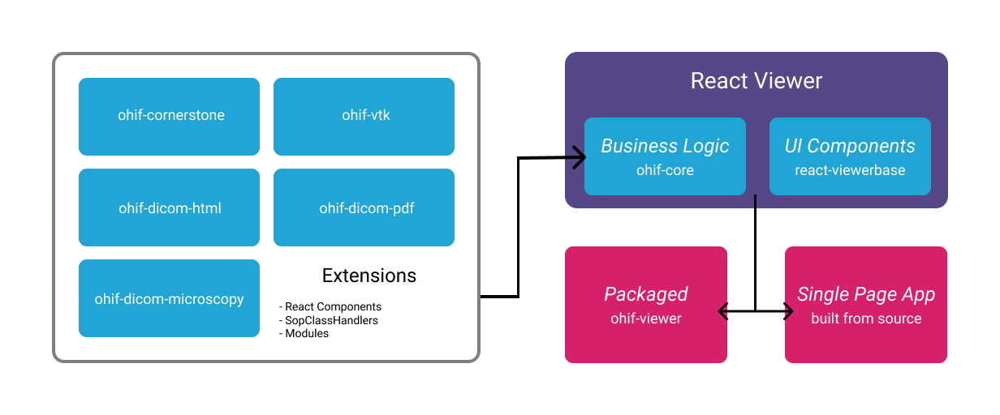

# Architecture

Looking to extend your instance of the Arcova Viewer? Want learn how to reuse _a
portion_ of the Viewer in your own application? Or maybe you want to get
involved and draft or suggest a new feature? Regardless, you're in the right
place!

The Arcova Viewer aims to be decoupled, configurable, and extensible; while this
allows our code to be used in more ways, it also increases complexity. Below, we
aim to demistify that complexity by providing insight into how our Viewer is
architected, and the role each of it's dependent libraries plays.


The [OHIF Medical Image Viewing Platform][viewers-project] is maintained as a
[`monorepo`][monorepo]. This means that this repository, instead of containing a
single project, contains many projects. If you explore our project structure,
you'll see the following:

```bash
.
├── extensions
│   ├── _example            # Skeleton of example extension
│   ├── cornerstone         # 2D images w/ Cornerstone.js
│   ├── dicom-html          # Structured Reports as HTML in viewport
│   ├── dicom-microscopy    # Whole slide microscopy viewing
│   ├── dicom-pdf           # View DICOM wrapped PDFs in viewport
│   └── vtk                 # MPR and Volume support w/ VTK.js
│
├── platform
│   ├── core                # Business Logic
│   ├── i18n                # Internationalization Support
│   ├── ui                  # React component library
│   └── viewer              # Connects platform and extension projects
│
├── ...                     # misc. shared configuration
├── lerna.json              # MonoRepo (Lerna) settings
├── package.json            # Shared devDependencies and commands
└── README.md
```

The `platform` directory contains the business logic library, component library,
and the application library that combines them to create a powerful medical
imaging viewer.

The `extensions` directory contains many packages that can be registered with
`@ohif/core`'s `ExtensionManager` to expand an application's supported features
and functionality.


<!-- <center><i>architecture diagram</i></center> -->

This diagram is a conceptual illustration of how the Viewer is architected.

1. (optional) `extensions` can be registered with `@ohif/core`'s
   `ExtensionManager`
2. `@ohif/core` provides business logic and a way for `@ohif/viewer` to access
   registered extensions
3. The `@ohif/viewer` composes and provides data to components from our
   component library (`@ohif/ui`)
4. The `@ohif/viewer` can be built and served as a stand-alone PWA, or as an
   embeddable package ([`@ohif/viewer`][viewer-npm])

## Business Logic

The [`@ohif/core`][core-github] project offers pre-packaged solutions for
features common to Web-based medical imaging viewers. For example:

- Hotkeys
- DICOM Web requests
- Hanging Protocols
- Managing a study's measurements
- Managing a study's DICOM metadata
- [A flexible pattern for extensions](./extensions/index.md)
- And many others

It does this while remaining decoupled from any particular view library or
rendering logic. While we use it to power our React Viewer, it can be used with
Vue, React, Vanilla JS, or any number of other frameworks.

## React Component Library

[`@ohif/ui`][ui-github] is a React Component library that contains the reusable
components that power the Arcova Viewer. It allows us to build, compose, and test
components in isolation; easing the development process by reducing the need to
stand-up a local PACS with test case data.

Extension authors can also use these same components when building their
extension's UI; allowing for a consistent look and feel with the rest of the
application.

[Check out our component library!](https://react.ohif.org/)

## Extensions & Configuration

While OHIF maintains several high value and commonly requested features in its
own extensions, there are many instances where one may wish to further extend
the viewer. Some common use cases include:

- Adding AI/ML tools and insights
- Custom workflows for guided diagnosis
- Collecting specific annotations for training data or reports
- Authentication and granular permissions
- Teleconsultation workflow, image comments, and tracking
- Adding surgical templating tools and reports
- and many others

We expose common integration points via [extensions](./extensions/index.md) to
make this possible. The viewer and many of our own extensions also offer
[configuration][configuration]. For a list of extensions maintained by OHIF,
[check out this helpful table](./extensions/index.md#maintained-extensions).

If you find yourself thinking "I wish the Viewer could do X", and you can't
accomplish it with an extension today, create a GitHub issue! We're actively
looking for ways to improve our extensibility ^\_^

[Click here to read more about extensions!](./extensions/index.md)

## Common Questions

> When should I use the packaged source `@ohif/viewer` versus building a PWA
> from the source?

...

> Can I create my own Viewer using Vue.js or Angular.js?

You can, but you will not be able to leverage as much of the existing code and
components. `@ohif/core` could still be used for business logic, and to provide
a model for extensions. `@ohif/ui` would then become a guide for the components
you would need to recreate.

<!--
  Links
  -->

<!-- prettier-ignore-start -->
[monorepo]: https://github.com/OHIF/Viewers/issues/768
[viewers-project]: https://github.com/OHIF/Viewers
[viewer-npm]: https://www.npmjs.com/package/@ohif/viewer
[pwa]: https://developers.google.com/web/progressive-web-apps/
[configuration]: ./configuring/index.md
[extensions]: ./extensions/index.md
[core-github]: https://github.com/OHIF/viewers/platform/core
[ui-github]: https://github.com/OHIF/Viewers/tree/master/platform/ui
<!-- prettier-ignore-end -->
